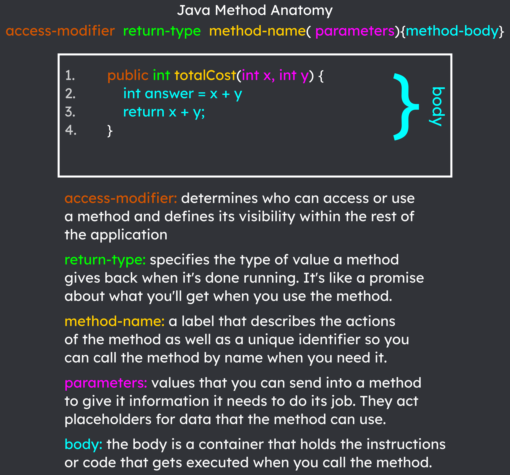
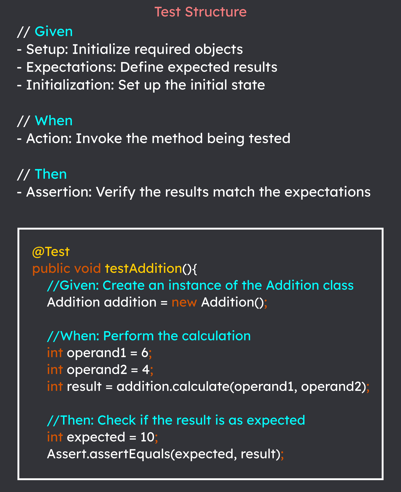

<link rel="stylesheet" type="text/css" media="all" href="./style.css" />
These are infographics I've created to aid with teaching/studying OOP principles, etc.

## Java Method Anatomy

## Java Class-Constructor-Object-Method-Relationship

## Test Structure

## File Tree Visualization

